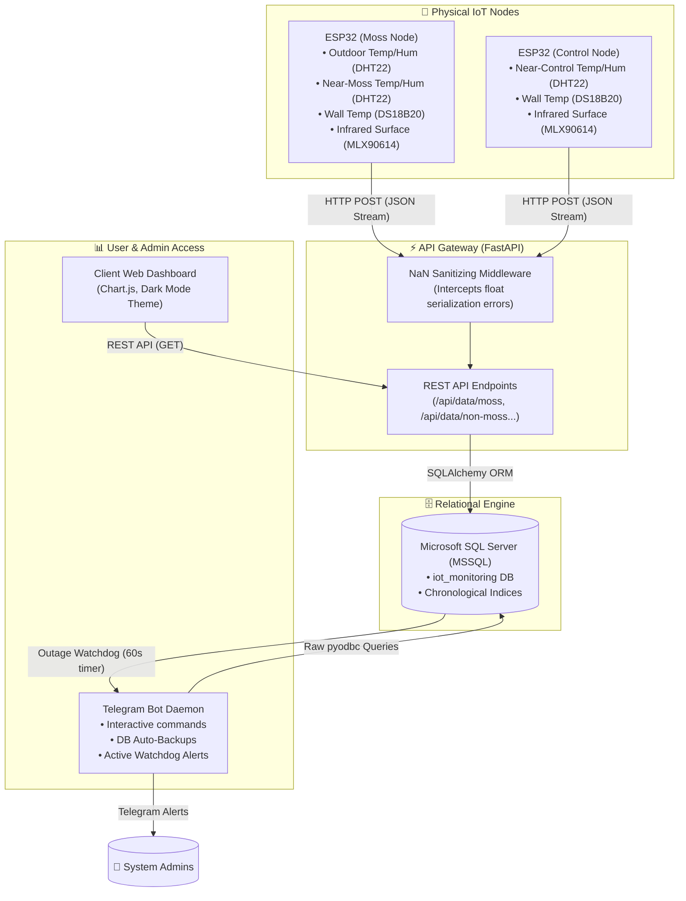
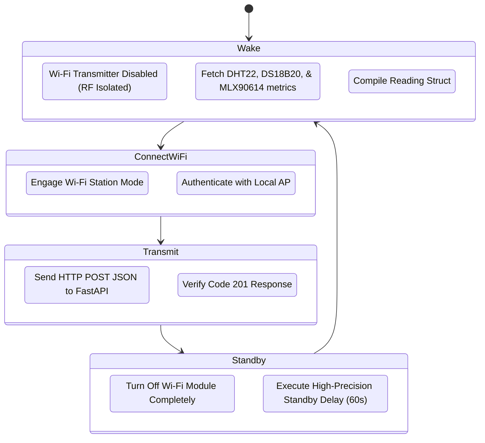

# Urban Heat — Comparative Environmental Monitoring of Moss-Based Cooling

An advanced IoT monitoring, analytics, and alerting ecosystem designed to measure, store, and compare the microclimate cooling and insulating performance of a moss-covered wall segment (green wall) against a dry control wall segment (non-moss building wall). 

This project delivers high-frequency real-time sensor streams, utilizes a robust relational database schema on Microsoft SQL Server, serves a modern data API via FastAPI, provides an administrative Telegram bot with active health watchdog daemons, and hosts a sleek client-side analytical dashboard.

---

## 🗺️ System Architecture

The ecosystem consists of five core components working in unison:



---

## 📦 Project Structure

```bash
urban-heat/
├── backend/                  # FastAPI Application, Database Schema, and Telegram Bot
│   ├── app/
│   │   ├── api/routes/       # Core REST Endpoints (Ingestion, Paginated History, Stats)
│   │   ├── core/             # Environment Configuration and DB Engine Initialization
│   │   ├── crud/             # SQL Alchemy Data Queries and Analytic Computations
│   │   ├── models/           # Declarative DB Table Classes for MSSQL
│   │   ├── schemas/          # Pydantic Ingestion / Serialization Contract Schemas
│   │   ├── main.py           # Main Web Application Gateway & Nan-Sanitizer Middleware
│   │   └── telegram_bot.py   # Telegram Bot Logic and Active Health Watchdog
│   ├── .env.example          # Template for MSSQL, CORS, and Telegram settings
│   ├── requirements.txt      # Backend Python Dependencies
│   ├── schema.sql            # Core MSSQL Database and Index Initialization Script
│   └── run_telegram_bot.py   # Startup Script for the Admin Telegram Service
├── frontend/                 # Client Web Dashboard (HTML5, Vanilla CSS, JS with Chart.js)
│   ├── assets/
│   │   ├── css/styles.css    # Premium Responsive Dark-Themed Styling
│   │   └── js/               # Page-Specific Interactive Visualization Logic
│   ├── index.html            # Main Live Sensor Status and Trend Charts
│   ├── history.html          # Historical Data Log Viewer
│   ├── compare.html          # Side-By-Side Interactive Metrics Compare Panel
│   ├── analysis.html         # Thermal Insulation and Diurnal Cycle Calculations
│   ├── moss-effect.html      # Specialized Microclimate Buffering Visualizations
│   └── export.html           # Structured Sensor Stream Exporter
├── sketch/                   # Physical ESP32 Hardware Firmware (Arduino C++)
│   ├── 1/1.ino               # Moss-Side Ingestion Node Firmware Code
│   └── 2/2.ino               # Control-Side Ingestion Node Firmware Code
└── moss_wall_report.pdf      # Detailed Comparative Analysis Research Document
```

---

## 🛠️ Hardware Specification & Low-Power Cycle

To guarantee extreme precision and prevent RF self-heating (where the ESP32's onboard Wi-Fi chip raises local ambient temperature readings), the firmware on both nodes executes an **isolated transmission cycle**:

### Physical Node Sensors

| Sensor Model | Metric Target | Node Placement | Read Protocol |
| :--- | :--- | :--- | :--- |
| **Adafruit MLX90614** | Contactless Surface Temperature | Infrared Field-of-View (FOV) on Wall | I2C (Pins 21, 22) |
| **Dallas DS18B20** | Internal Structural Wall Temperature | Core Sub-surface Substrate | One-Wire (Dallas Bus) |
| **DHT22 (AM2302)** | Microclimate Air Temperature & Humidity | Node Internal Ambient / Canopy Boundary | 1-Pin Digital Protocol |

### Low-Power Operation Loop



---

## ⚡ Backend Technical Features

### 🛡️ Real-Time NaN-Sanitizing Middleware
When an ESP32 sensor experiences intermittent hardware errors (e.g. wire jitter), the standard Arduino float readings yield `NAN` or `Infinity`. When serialized to raw strings, this results in unquoted `"nan"` or `"inf"` literals, which fail standard RFC-8259 JSON parsers.
Our FastAPI backend intercepts these payloads using raw HTTP byte stream middleware and sanitizes them into standard JSON `null` values before the parsing pipeline executes:
```python
_NAN_INF_RE = re.compile(r'"?(?:\bnan\b|-?\binf(?:inity)?\b)"?', re.IGNORECASE)

@app.middleware("http")
async def sanitize_nan_middleware(request: Request, call_next):
    if request.method in ("POST", "PUT", "PATCH") and "application/json" in request.headers.get("content-type", ""):
        raw_body = await request.body()
        body_text = raw_body.decode("utf-8", errors="replace")
        if _NAN_INF_RE.search(body_text):
            sanitized_bytes = _NAN_INF_RE.sub("null", body_text).encode("utf-8")
            request._receive = lambda: {"type": "http.request", "body": sanitized_bytes}
            request._body = sanitized_bytes
    return await call_next(request)
```

### 🤖 Telegram Command & Ingestion Watchdog Daemon
The administrative Telegram bot manages system health, DB upkeep, and alerts administrators.
* **Commands**:
  * `/start` — Welcomes administrators and reveals their unique chat ID for secure config enrollment.
  * `/latest` — Reads current data from MSSQL, computes the instantaneous contactless **surface cooling delta** (\(T_{Control} - T_{Moss}\)), and prints formatted statistics in IST.
  * `/backup` — Triggers an active database BACKUP script to export `.bak` containers to host storage.
* **Active Watchdog**:
  Runs a background scheduler every 60 seconds. If either the `moss` or `non_moss` nodes fail to ingest fresh telemetry within `TELEGRAM_DATA_TIMEOUT_MINUTES` (defaults to 5 mins), the bot pushes real-time outage warnings to all enrolled chat IDs, ensuring physical node failures are discovered instantly.

---

## 🗄️ Database Setup (MSSQL)

Configure your Microsoft SQL Server instance using the schema located in [backend/schema.sql](backend/schema.sql).

### Table Schema Highlights
* **`moss_data`**: Chronological log of ambient temperatures, humidity, moss microclimate conditions, moss surface infrared measurements, and structural wall temperatures.
* **`non_moss_data`**: Chronological control data containing dry surface infrared measurements, adjacent air microclimates, and dry wall interior temperatures.
* **Indices**: Clustered physical keys with primary non-clustered, high-performance chronological indices (`IX_moss_data_timestamp` and `IX_non_moss_data_timestamp`) to optimize high-speed range scans during client-side history queries.

---

## 🚀 Installation & Running

### 1. Database Setup
Ensure Microsoft SQL Server is running, then execute the schema initialization:
```bash
sqlcmd -S localhost -U sa -P YourStrongPasswordHere -i backend/schema.sql
```

### 2. Configure Environment Variables
Copy `backend/.env.example` to `backend/.env` and adjust the variables:
```bash
cp backend/.env.example backend/.env
```
Ensure you set your database host credentials, your unique **Telegram Bot Token** (obtained from [@BotFather](https://t.me/BotFather)), and target **Telegram Chat IDs** for alerts.

### 3. Install Backend Dependencies & Run
Set up a Python virtual environment and run the FastAPI server:
```bash
cd backend
python -m venv .venv
.\.venv\Scripts\Activate.ps1   # On Windows PowerShell
pip install -r requirements.txt

# Run the API server
uvicorn app.main:app --host 0.0.0.0 --port 8000 --reload
```
* **Interactive Swagger Interface**: `http://127.0.0.1:8000/docs`
* **Alternate ReDoc Interface**: `http://127.0.0.1:8000/redoc`

### 4. Run the Telegram Bot Daemon
Open a separate terminal window and launch the background bot daemon:
```bash
cd backend
.\.venv\Scripts\Activate.ps1
python run_telegram_bot.py
```

### 5. Launch the Web Dashboard
Since the frontend client is a zero-dependency static web application, it can be hosted using any basic static HTTP server:
```bash
cd frontend
python -m http.server 5500
```
Open `http://127.0.0.1:5500/index.html` in your web browser.

---

## 📊 Interactive Web Client Features

The frontend client utilizes a high-contrast, premium dark mode styling tailored around **Vanilla CSS variables** and **Chart.js**.

* **Live Dashboard (`index.html`)**: Features real-time responsive cards reflecting temperature, humidity, and wall statuses with synchronous rolling temporal graphs updating every 10 seconds.
* **Historical Data Log (`history.html`)**: Employs query filters allowing users to parse database records across customizable granular intervals.
* **Side-by-Side Comparison (`compare.html`)**: Contrasts moss and dry wall performance directly, demonstrating daily temperature fluctuations.
* **Mathematical Analytics (`analysis.html`)**: Calculates active thermal characteristics, detailing the cooling delta trends and peak heat load reductions.
* **The Moss Effect (`moss-effect.html`)**: Visually decomposes microclimate buffering, plotting humidity-buffering curves to illustrate evapotranspiration cooling.
* **Structured Exporter (`export.html`)**: Packages selected sensor metrics into CSV data structures for downstream modeling in specialized scientific packages.

---

## ⚡ API Endpoints Reference

The FastAPI backend exposes a robust series of REST API endpoints categorized by function: Ingestion and Analytics.

### 1. Telemetry Ingestion Endpoints

#### 📥 Ingest Moss Node Telemetry (`POST /api/data/moss`)
- **Description**: Receives JSON streams from the Moss physical sensor node containing outdoor microclimate readings, near-moss boundary conditions, and inner wall temperatures.
- **Request Body Contract**:
  ```json
  {
    "outdoor_temp": 28.5,
    "outdoor_humidity": 65.2,
    "moss_surface_temp": 24.1,
    "near_moss_temp": 25.3,
    "near_moss_humidity": 78.4,
    "wall_temp": 22.8
  }
  ```
- **Response**: Returns standard HTTP 201 with the created record and server-side generated database ID and timezone-aware IST timestamp.

#### 📥 Ingest Control Node Telemetry (`POST /api/data/non-moss`)
- **Description**: Receives telemetry payload from the dry non-moss control node.
- **Request Body Contract**:
  ```json
  {
    "non_moss_surface_temp": 32.4,
    "near_non_moss_temp": 29.8,
    "near_non_moss_humidity": 60.1,
    "wall_temp": 28.9
  }
  ```

### 2. Analytics & Reporting Endpoints

#### 📊 Fetch Latest Readings (`GET /api/data/latest`)
- **Description**: Retrieves the single latest recorded row from both the `moss` and `non_moss` tables and computes the current instantaneous contactless surface cooling delta ($T_{Control} - T_{Moss}$).
- **Response Format**:
  ```json
  {
    "moss": { ... },
    "nonMoss": { ... },
    "coolingDeltaSurface": 8.3
  }
  ```

#### 🗓️ Fetch History (`GET /api/data/history`)
- **Query Parameters**:
  - `start` (string, required): Start date in `YYYY-MM-DD`
  - `end` (string, required): End date in `YYYY-MM-DD`
- **Description**: Retrieves all non-paginated telemetry records within the designated date range.

#### 📖 Fetch Paginated & Filtered History (`GET /api/data/history/paginated`)
- **Query Parameters**:
  - `start` (required), `end` (required): Dates in `YYYY-MM-DD`
  - `startTime` (optional): Filter bounds in `HH:MM`
  - `endTime` (optional): Filter bounds in `HH:MM`
  - `minHumidity` / `maxHumidity` (optional, float 0-100): Filter bounds for humidity measurements
  - `page` (optional, default=1): Page number (1-indexed)
  - `per_page` (optional, default=30): Items per page
- **Description**: Merges and returns page-by-page rows from both tables matching active filters, suitable for rendering tabular historical logs.

#### ⚖️ Side-by-Side Comparison (`GET /api/data/compare`)
- **Description**: Queries database to calculate aggregations comparing moss-covered versus control wall conditions, including average temperatures, peak differences, and minimum structural thermal loads.

#### 🧬 Deep Analysis Report (`GET /api/data/analysis`)
- **Query Parameters**: Same filters as `/history/paginated` (dates, times, humidity ranges).
- **Description**: Performs high-performance SQL analytical grouping and returns a unified scientific analysis payload containing:
  - `timeSeries`: Hourly aggregated average trends for graph visualization.
  - `descriptiveStats`: Mean, standard deviation, min, and max for each metric.
  - `diurnal`: Temperature fluctuations during distinct diurnal hours.
  - `cooling`: Average temperature buffering calculations.
  - `humidityBuffering`: Aggregated readings grouped by outdoor humidity ranges to demonstrate evapotranspiration capacity.
  - `hourlyPattern`: 24-hour cycle aggregation showing thermal lag and dampening behavior.

